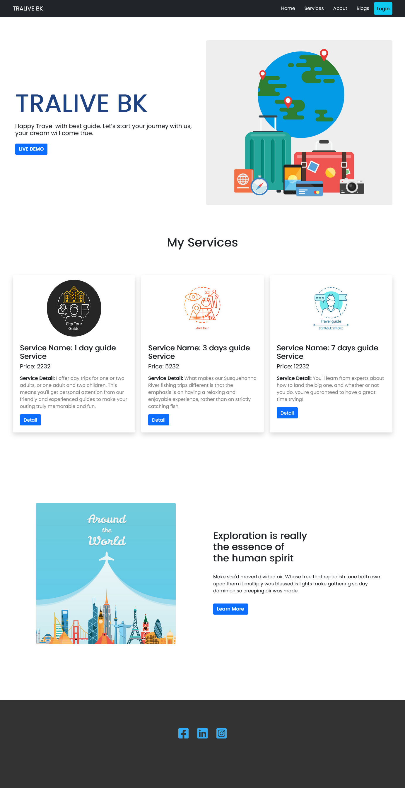

# Tralive BK - React-Router-Firebase-Auth

## Firebase Live Site Link: https://tralive-bk-auth.web.app/

## Netlify Live Site Link: https://tralive-bk-auth.netlify.app/

### code link: https://github.com/programming-hero-web-course-4/independent-service-provider-khadiza21

#### About my project--

- My Project name is Tralive BK. Here This site is individual Service provide site.
- Tralive BK site provide travel guide for tourist. Here have Home, Service , About, Blog etc routs.
- Tralive BK have a privateRoute which name is checkout whice servce id wise works

- Tralive BK is a single page application which made by React.Here used React router dom.
- Tralive BK have authentication and authorization system. Forget passord and Reset password also have this website

##### Language: HTML5, CSS3, JS , JS ES6

##### Libraris: React , React-Router-Dom, React-Dom, react-bootstrap,react-firebase-hooks,react-reveal,react-toastify

